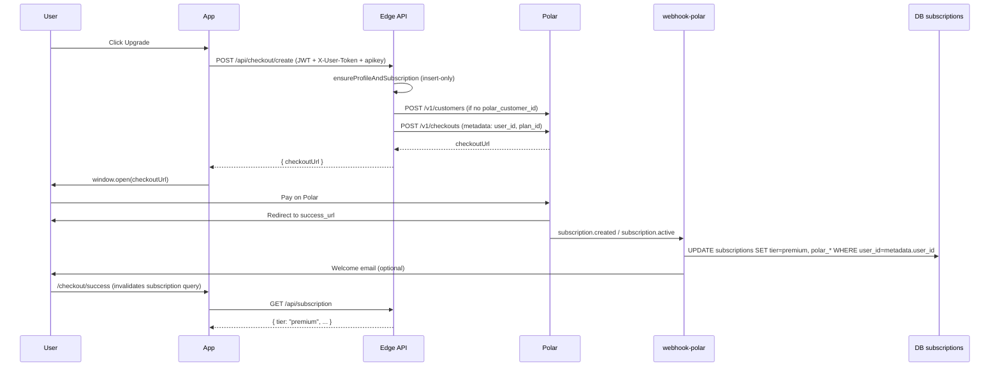

# Subscription flow – full scenarios and audit

Single reference for the entire subscription lifecycle: checkout, webhooks, portal, and edge cases.

---

## 1. High-level flow

---

## 2. API endpoints

| Endpoint | Method | Auth | Purpose |
|----------|--------|------|---------|
| `/api/subscription` | GET | Required | Returns subscription row; calls `ensureProfileAndSubscription` (insert-only so existing tier is never overwritten). |
| `/api/checkout/create` | POST | Required | Creates Polar checkout; ensures profile/sub; gets/creates Polar customer; returns `{ checkoutUrl }`. |
| `/api/checkout/portal` | GET | Required | Creates Polar customer portal session; requires `polar_customer_id`; returns `{ url }`. |

---

## 3. Scenarios

### 3.1 Happy path – new premium user

1. User is logged in, has email, tier is free.
2. User clicks Upgrade → `POST /api/checkout/create` with token (and optionally X-User-Token).
3. Edge: `ensureProfileAndSubscription` (profile/sub row exists; upsert uses `ignoreDuplicates: true` so tier stays unchanged). Get or create Polar customer, POST to Polar checkouts with `metadata: { user_id, plan_id }`.
4. Client opens Polar checkout URL in new tab; user pays.
5. Polar redirects to `success_url` (e.g. `/dashboard/checkout/success?returnTo=/dashboard`).
6. Polar sends `subscription.created` or `subscription.active` to webhook with `data.metadata.user_id`, `data.metadata.plan_id` (from checkout metadata).
7. Webhook updates `subscriptions` for that `user_id` to tier premium/pro, sets `polar_subscription_id`, `polar_customer_id`, period dates; sends welcome email.
8. User lands on CheckoutSuccess; React Query invalidates `subscription` and `usage-limits`; next GET /api/subscription returns premium.

### 3.2 Checkout cancelled

1. User starts checkout, then cancels on Polar.
2. Polar redirects to `return_url` (e.g. `/dashboard/upgrade` or `/dashboard/checkout/cancel` depending on Polar config).
3. No webhook for “checkout abandoned”; tier remains free. Optional: use Polar’s `checkout.updated` or similar if you need to track.

### 3.3 Manage subscription (portal)

1. User is premium and has `polar_customer_id` in `subscriptions`.
2. User clicks “Manage subscription” (Dashboard or Profile) → `GET /api/checkout/portal?returnUrl=...`.
3. Edge: loads `polar_customer_id`, POST to Polar `v1/customer-sessions`, returns `{ url }`.
4. Client redirects to Polar portal (same tab). User can cancel, update payment, etc.
5. On cancel/revoke, Polar sends `subscription.canceled` or `subscription.revoked`; webhook sets tier to free and sends cancel email.

### 3.4 Subscription updated (renewal, plan change)

1. Polar sends `subscription.updated` with `data.id` (Polar subscription id), `current_period_start`, `current_period_end`, `status`.
2. Webhook: if `data.metadata.user_id` present, updates by `user_id`; else updates by `polar_subscription_id` (so we can handle events where metadata is missing).
3. Tier is not changed on update (only period/status); tier changes only on created/active (premium) or canceled/revoked (free).

### 3.5 User has no email

1. Checkout/create requires email for creating a Polar customer when `polar_customer_id` is null.
2. If `user.email` is missing/empty, Edge returns 400: “Email required for checkout. Add an email to your account.”
3. User must add email in profile (or use OAuth that provides email) then retry.

### 3.6 Polar returns 401/403 (invalid POLAR_ACCESS_TOKEN)

1. Edge calls Polar with `Authorization: Bearer POLAR_ACCESS_TOKEN`. If token is expired/invalid, Polar returns 401 (or 403).
2. Edge no longer forwards that as 401 to the client (to avoid “session expired” UX). Edge returns **502** with body `{ error: "Payment provider authentication failed. Please try again later or contact support.", code: "polar_auth" }`.
3. Fix: set a valid `POLAR_ACCESS_TOKEN` in Supabase Edge secrets (Polar Dashboard → API / access tokens).

### 3.7 Webhook signature invalid

1. Webhook verifies `webhook-signature` (or `x-webhook-signature`) with HMAC-SHA256 using `POLAR_WEBHOOK_SECRET`.
2. If verification fails, webhook returns 401 and does not process. Polar will retry (e.g. up to 10 times).
3. Ensure `POLAR_WEBHOOK_SECRET` in Supabase matches the secret configured in Polar for the webhook endpoint.

### 3.8 Webhook payload missing metadata.user_id

1. For `subscription.created` / `subscription.active`, we set tier by `metadata.user_id`. If Polar does not forward checkout metadata in the subscription event, `userId` is undefined and we do not update any row (we only update when `userId` is present).
2. Mitigation: Polar should forward metadata from checkout to subscription; confirm in Polar docs/dashboard. For `subscription.updated` / `subscription.canceled` / `subscription.revoked` we fall back to lookup by `polar_subscription_id` so those events still work.

### 3.9 GET /api/subscription and ensureProfileAndSubscription

1. Every GET /api/subscription calls `ensureProfileAndSubscription(userId, email, displayName)`.
2. **Profile:** If no profile row, insert one (with display_name from param or email). If row exists, do **not** overwrite (no update call).
3. **Subscription:** Upsert with `{ user_id, tier: "free", status: "active" }` and **`ignoreDuplicates: true`**. So we only **insert** when no row exists (new user). We never overwrite an existing row; premium users keep their tier. (Previously, upsert without ignoreDuplicates would set every user to free on every GET – that bug is fixed.)

### 3.10 Checkout success page – no webhook yet

1. User lands on /checkout/success immediately after payment; Polar may not have sent the webhook yet.
2. CheckoutSuccess invalidates `subscription` and `usage-limits`; client refetches GET /api/subscription. If webhook has not run, tier is still free until webhook fires (usually within seconds).
3. Optional: poll GET /api/subscription a few times with short delay, or show “Activating your plan…” until tier flips to premium.

### 3.11 Auth and checkout (401 from our API vs Polar)

1. **Our API 401:** Missing/invalid user JWT. We return `{ error: "Unauthorized", code: "missing_auth_header" | "token_expired" | ... }` and header `X-Auth-Failure-Code`. Client can show “Session expired” and retry with fresh token.
2. **Polar 401:** Invalid POLAR_ACCESS_TOKEN. We return **502** with `code: "polar_auth"` so the client does not treat it as user session expiry.

---

## 4. Webhook events handled

| Event | Action |
|-------|--------|
| `checkout.created` | No DB change (activation on subscription.created/active). |
| `subscription.created` / `subscription.active` | Update `subscriptions` by `metadata.user_id`: set tier (from plan_id), status, polar_subscription_id, polar_customer_id, period dates; send welcome email. |
| `subscription.updated` | Update period dates and status by user_id (if metadata.user_id) or by polar_subscription_id. |
| `subscription.canceled` / `subscription.revoked` | Find row by polar_subscription_id; set tier=free, status=canceled; send cancel email. |

---

## 5. Required secrets

| Secret | Where | Used by |
|--------|--------|---------|
| `POLAR_ACCESS_TOKEN` | Supabase Edge | api (checkout/create, checkout/portal) |
| `POLAR_WEBHOOK_SECRET` | Supabase Edge | webhook-polar (signature verification) |
| `RESEND_API_KEY`, `FROM_EMAIL` | Supabase Edge | webhook-polar (welcome/cancel emails) |

---

## 6. Frontend entry points

| Location | Action |
|----------|--------|
| Upgrade page | CheckoutButton (planId, productId, returnTo) → opens Polar in new tab. |
| Dashboard (premium) | “Manage subscription” → GET checkout/portal → redirect to Polar portal. |
| Profile (premium) | “Manage subscription” → same. |
| CheckoutSuccess | Invalidate subscription + usage-limits; “Go to Dashboard”, “Manage billing”; auto-redirect after 5s. |
| CheckoutCancel | “Back to Upgrade” / “Back to Pricing”, “Continue with Free Plan”. |

---

## 7. Bug fix applied

- **ensureProfileAndSubscription** previously used `upsert(..., { onConflict: "user_id" })` without `ignoreDuplicates`. That overwrote existing subscription rows with `tier: "free"` on every GET /api/subscription, effectively downgrading premium users. **Fix:** add `ignoreDuplicates: true` so we only insert when no row exists; existing rows (and their tier) are left unchanged.
